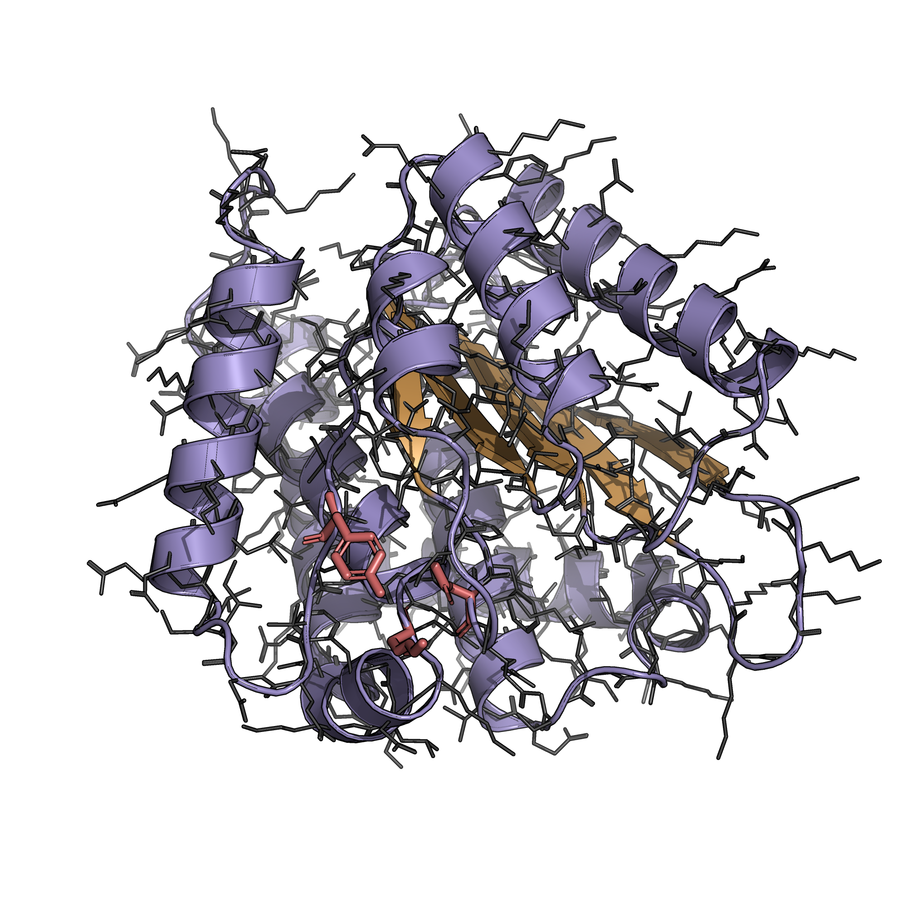
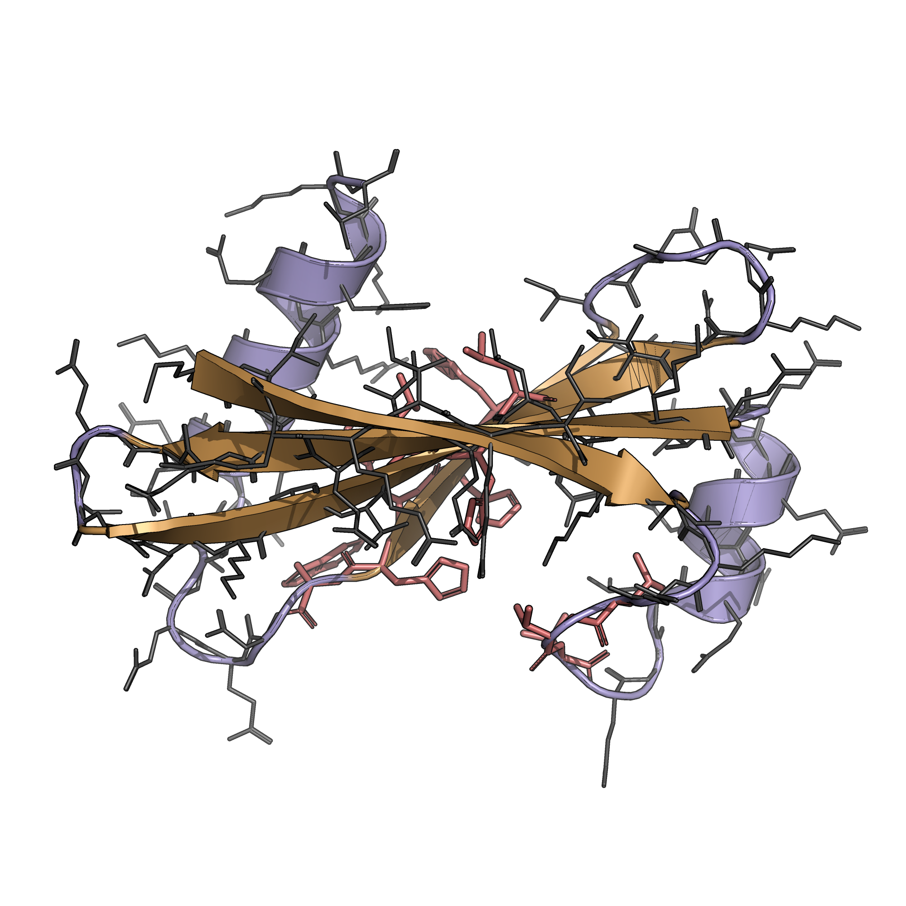
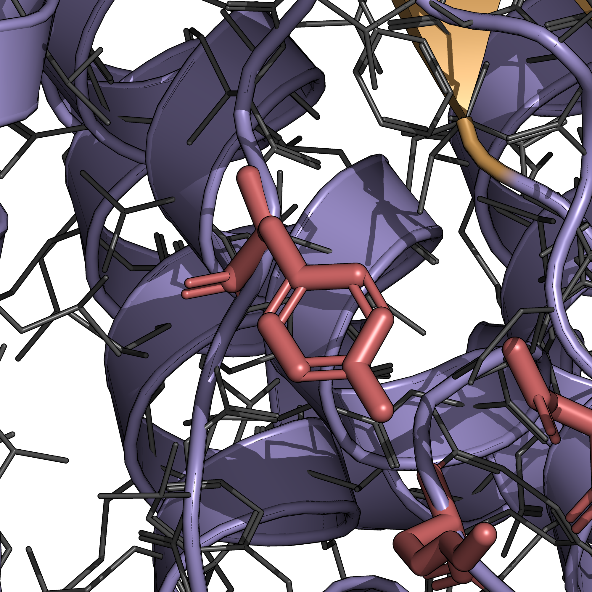
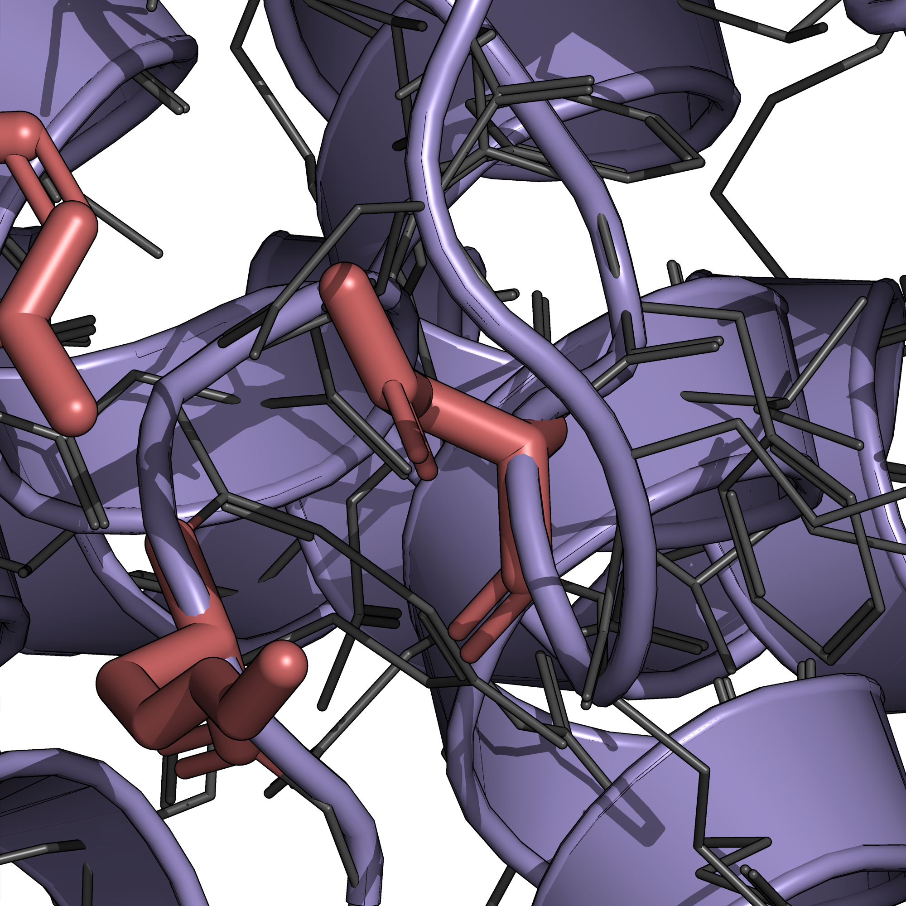
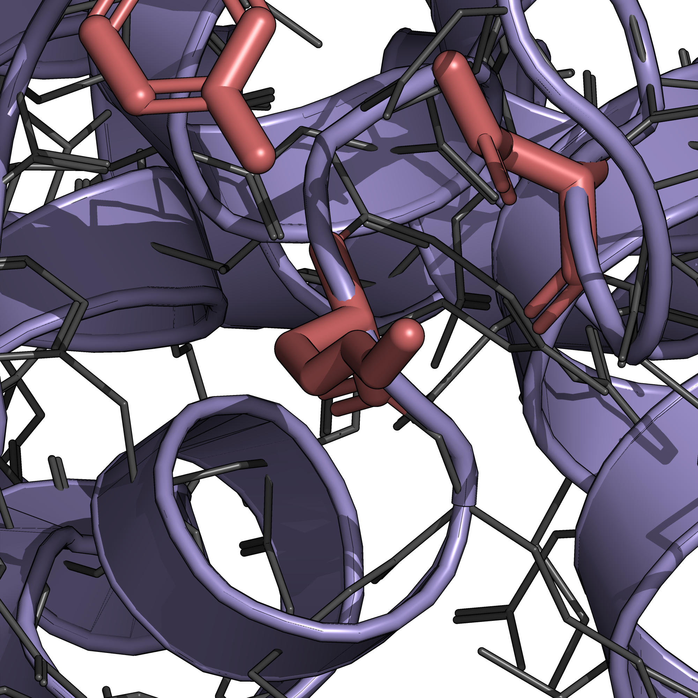

# PyMoS: Motif-Scaffolding Visualization

PyMOL renderer for motif-scaffolding outputs — purple helices, gold sheets, thin grey atomic lines, and motif residues highlighted in coral red.

<p align="center">
  
</p>

## Setup

```bash
conda create -n pymol_env -c conda-forge python=3.10 pymol-open-source -y
conda activate pymol_env
pip install biotite numpy torch pyyaml
```

## Usage

### Render PNGs

```bash
# Headless: render to results/
pymol -cq auto_render.py -- --pdbs 5AOU 5YUI --motif

# GUI: load styled structure for inspection
pymol auto_render.py -- --pdbs 5AOU --motif --interactive

# Replay a saved orientation (see set_view.py below)
pymol -cq auto_render.py -- --pdbs 5AOU --motif --view
```

Options:
- `--pdbs ID [ID ...]` — PDB ids in `data/` to render (required)
- `--motif` — highlight motif residues for benchmark PDBs registered in `configs/generation/motif_dict.yaml` (sticks on side chains, red on conditioning atoms only)
- `--interactive` — leave the styled structure in PyMOL; skip ray/PNG
- `--view` — use the saved orientation in `views/<PDB>.txt` instead of `cmd.orient`

When `--motif` is enabled, full-structure PNGs go to `results/`, and per-residue motif close-ups go to `results/motifs/<PDB>_motif_{a,b,c,...}.png`.

### Saving Custom Views

`set_view.py` opens a styled GUI session, lets you rotate manually, and saves the orientation for later replay by `auto_render.py --view`.

```bash
pymol set_view.py -- --pdbs 5AOU --motif
```

In the PyMOL command line:
- `save_view <PDB>` — save the current view to `views/<PDB>.txt`
- `view_pdb <PDB>` — switch to another loaded PDB (when multiple were passed)

## Project Layout

```
auto_render.py   # batch renderer (full structures + motif close-ups)
set_view.py      # interactive view setter / saver
utils.py         # La-Proteina motif locator (uidx_aa case)
configs/         # motif_dict.yaml — benchmark task definitions
data/            # input PDBs + motif benchmark PDBs
views/           # saved orientations: <PDB>.txt
results/         # rendered PNGs (motifs/ subdir for close-ups)
assets/          # sample images for this README
```

## Gallery

### Full Structures Visualization

<p align="center">
  
  
</p>

### Motif Zoom-in Visualization (5AOU)

<p align="center">
  
  
  
</p>
