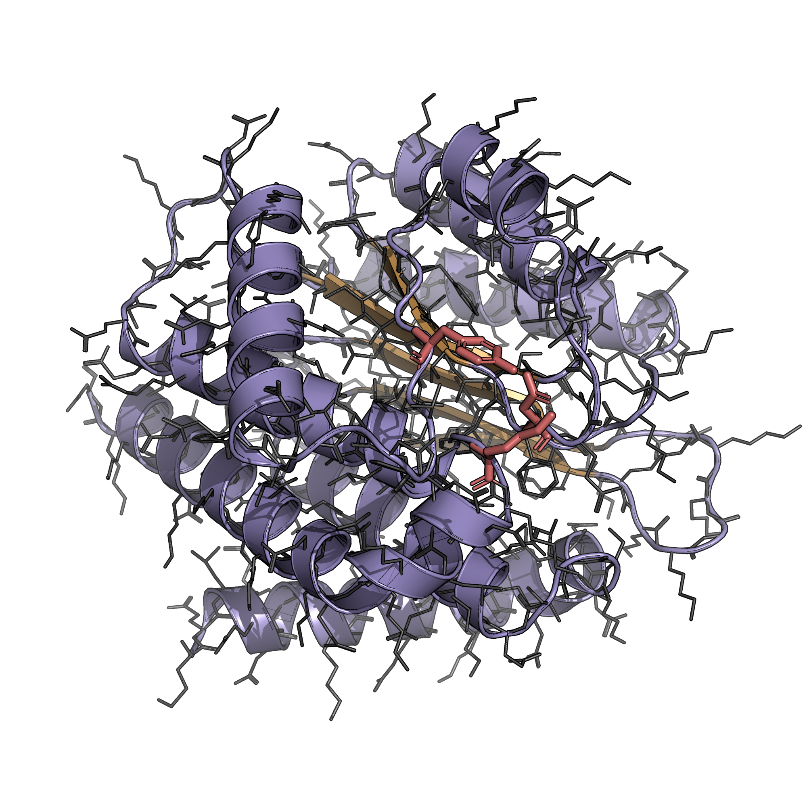

# Motif-Scaffolding-Visualization

PyMOL renderer for motif-scaffolding outputs — purple helices, gold sheets, and motif residues highlighted in coral red.

<p align="center">
  
</p>

## Setup

```bash
conda create -n pymol_env -c conda-forge python=3.10 pymol-open-source -y
conda activate pymol_env
pip install biotite numpy torch pyyaml
```

## Usage

```bash
# Render PNGs (headless)
pymol -cq auto_render.py -- --pdbs 5YUI 5AOU --motif

# Open in GUI to inspect / tweak
pymol auto_render.py -- --pdbs 5YUI --motif --interactive
```

Options:
- `--pdbs ID [ID ...]` — PDB ids in `data/` to render (default: `5YUI`)
- `--motif` — highlight motif residues from `configs/generation/motif_dict.yaml`
- `--interactive` — leave the styled structure loaded in PyMOL (skip ray/PNG)

PNGs are saved to `results/`.
